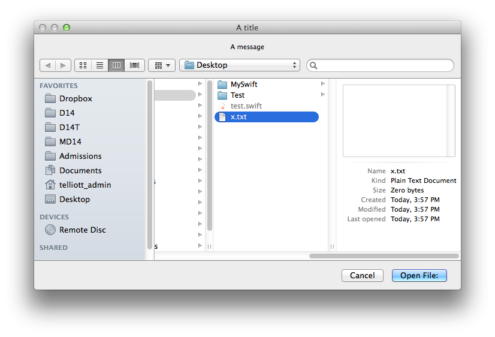

.. _closures2:

################
More on Closures
################

The description of closures given in the docs gives these advantages:

    Closures are self-contained blocks of functionality that can be passed around and used in your code. Closures in Swift are similar to blocks in C and Objective-C and to lambdas in other programming languages.

    Closures can capture and store references to any constants and variables from the context in which they are defined. This is known as closing over those constants and variables, hence the name "closures." Swift handles all of the memory management of capturing for you.

They go on:

    Global and nested functions, as introduced in Functions, are actually special cases of closures. Closures take one of three forms:

    -Global functions are closures that have a name and do not capture any values.
    
    -Nested functions are closures that have a name and can capture values from their en closing function.
    
    -Closure expressions are unnamed closures written in a light weight syntax that can capture values from their surrounding context.

So a key feature is that closures capture values from the environment when they are called.  Global functions don't do this.  Or they shouldn't.  However this:

.. sourcecode:: bash

    let s = "Hello"
    func f() { println(s) }
    f()
    
Actually *does* print ``5``.  Even this does:

.. sourcecode:: bash

    let s = "Hello"
    func f() -> () -> () {
        func g() {
             println(s)
        }
        return g
    }
    let h = f()
    h()

In this example, we return a function from a function.  The function's type is ``() -> ()``, it takes no arguments and returns void.  We could modify it to eliminate the identifier ``g``:

.. sourcecode:: bash

    let s = "Hello"
    func f() -> () -> () {
        return { println(s) }
    }
    let h = f()
    h()

A great example of progressive simplification of closures is the global ``sorted`` function, which takes an array to be sorted and a sort method as the second argument.  So to sort Strings or Ints you might write this code:

.. sourcecode:: bash

    func rev(s1: String, s2: String) -> Bool { return s1 > s2 }
    var a = ["a","b","c"]
    a.sort(rev)
    println(a)
    // [c, b, a]

Or we might use the function with ``sorted``

.. sourcecode:: bash

    func rev(s1: String, s2: String) -> Bool { return s1 > s2 }
    let names = ["Bob", "Alex", "Charlie"]
    let a = sorted(names, rev)
    println(a)
    // ["Charlie", "Bob", "Alex"]

In this case, it does seem silly to use a name for ``rev``, if we could just put it directly as the second argument to ``sorted``.  So we use a closure:

.. sourcecode:: bash

    let names = ["Bob", "Alex", "Charlie"]
    let reversed = sorted(names, {
         (s1: String, s2: String) -> (Bool)
         in return s1 > s2})
    println(reversed)
    // [Charlie, Bob, Alex]

In fact, the docs say that the closure's argument types can always be inferred from the context when a closure is passed as an argument to another function.  In fact, the return type can be inferred as well.  So we can lose them and the compiler won't complain:

.. sourcecode:: bash

    let names = ["Bob", "Alex", "Charlie"]
    let reversed = sorted(names,{ s1, s2 in return s1 > s2})
    println(reversed)
    // [Charlie, Bob, Alex]

If the entire closure is a single expression, the return can also be omitted.

.. sourcecode:: bash

    let names = ["Bob", "Alex", "Charlie"]
    let reversed = sorted(names,{ s1, s2 in s1 > s2})
    println(reversed)
    // [Charlie, Bob, Alex]

Now admittedly, this is pretty brief.  Also, the ``in`` looks weird, so don't try to parse its meaning but just remember that it says:  the closure body is beginning now.

As we saw in the previous section ____, we don't need variable names

.. sourcecode:: bash

    let names = ["Bob", "Alex", "Charlie"]
    let reversed = sorted(names, { $0 > $1} )
    println(reversed)
    // [Charlie, Bob, Alex]
    

I found out later that even this will work!

.. sourcecode:: bash

    let names = ["Bob", "Alex", "Charlie"]
    let reversed = sorted(names, >)
    println(reversed)
    // [Charlie, Bob, Alex]
    
And finally, you can do this
    
.. sourcecode:: bash

    let a = [1,2,3]
    let b = sorted(a) { $0 > $1 }
    println(b)
    [3, 2, 1]

or even this (no other arguments):

.. sourcecode:: bash

    var a = [1,2,3]
    a.sort { $0 > $1 }
    println(a)
    // [3, 2, 1]
    
These are called "trailing" closures.

For a list of different ways to use closures in Swift, you could look here:

http://fuckingclosuresyntax.com

We covered most of these in the sort example above. 

A lot of the complexity comes from the compiler being able to infer argument types and return types, even arguments and return values themselves, as well as being able to dispense with the call operator ``()`` in some cases.

At the top of the list are these:

    - variable
    - typealias
    - constant

And these are the declaration syntax (``c`` is for closure, ``p`` for parameter, and ``r`` for return):

.. sourcecode:: bash

    var cName: (pTypes) -> (rType)
    typealias cType = (pTypes) -> (rType)
    let cName: closureType = { ... }

Let's start with a closure that takes a String argument and returns one as well:

.. sourcecode:: bash

    func f (name: String, myC: (String) -> String) -> String {
            let t = myC(name)
            return "*" + t + "*"
        }

    let result = f("Peter Pan", { s in "Hello " + s } )
    println(result)

.. sourcecode:: bash

    > xcrun swift test.swift
    *Hello Peter Pan*
    >

We can modify this by using a ``typealias``, as follows

.. sourcecode:: bash

    typealias greeting = (String) -> (String)
    func f(name: String, myC: greeting) -> String {
        let t = myC(name)
        return "*" + t + "*"
    }

    let result = f("Peter Pan", { s in "Hello " + s } )
    println(result)

That helps a little bit.  What helps more (though it makes things a little murkier), is being able to leave things out.  If the function doesn't return anything, we can do this:

(more)

One place where the Cocoa idiom is to use blocks is for callbacks from open panels and save panels.  In Objective C we have

.. sourcecode:: bash

    [panel beginSheetModalForWindow:window      
                  completionHandler:^(NSInteger result) {
        if (result == NSFileHandlingPanelOKButton) {
                NSURL*  theFile = [panel URL];
                // Write the contents in the new format.
        }
    }];
    
The structure here is that the method takes a (pointer to) window object and an Objective C "block", similar to what we have as closures in Swift.  The block's code is contained inside the method call, anonymously, comprising everything up to the ``}];``.

The second parameter is 

.. sourcecode:: bash

    completionHandler:^(NSInteger result) { }
    
The ``^(NSInteger result) { }`` defines a block that takes an ``NSInteger`` and doesn't return anything.  That's the type of block that this method on NSOpenPanel requires.

If we're going to do this in Swift, we'll do something like

.. sourcecode:: bash

    func f (name: String, myC: (String) -> String) -> String {

from before, except our closure won't return anything and the method won't return anything either..

.. sourcecode:: bash

    panel.beginSheetModalForWindow(window, handler:###)

And now we need to replace the ``###`` with a block/closure that takes an NSInteger and doesn't return anything..

.. sourcecode:: bash

    panel.beginSheetModalForWindow(window, handler:(NSInteger) in { 
        if (result == NSFileHandlingPanelOKButton) {
            let theFile = panel.URL
            println(theFile)
    })

The above doesn't actually work.  But what I got off the web does

http://meandmark.com/blog/

.. sourcecode:: bash

    import Cocoa
    var op = NSOpenPanel()

    op.prompt = "Open File:"
    op.title = "A title"
    op.message = "A message"
    // op.canChooseFiles = true  // default
    // op.worksWhenModal = true  // default
    op.allowsMultipleSelection = false
    // op.canChooseDirectories = true  // default
    op.resolvesAliases = true
    op.allowedFileTypes = ["txt"]

    let home = NSHomeDirectory()
    let d = home.stringByAppendingString("/Desktop/")
    op.directoryURL = NSURL(string: d)

    op.beginWithCompletionHandler { (result: Int) -> Void in
        if (result == NSFileHandlingPanelOKButton) {
            let f = op.URL
            println(f)
        }
    }

The above is another example of a "trailing" closure. The method has no ``()`` call operator.

You can wrap everything from ``{ result: Int .. println(f) }}`` in parentheses like a regular method call, and that'll still work, but you can't say ``handler:`` like I had above.  I get:

.. sourcecode:: bash

    extraneous argument label 'handler:'

Also, since the types of the arguments can be figured out, it should be possible to lose the type information and just have:

.. sourcecode:: bash

    op.beginWithCompletionHandler {

but so far, this doesn't work.  I get

.. sourcecode:: bash

    > xcrun swift test.swift
    test.swift:5:15: error: cannot convert the \
    expression's type '() -> () -> $T0' \
    to type '() -> () -> $T0'
    var handler = { 
                  ^~
    >

I also thought I should be able to do:

.. sourcecode:: bash

    var handler = {
        if ($0 == NSFileHandlingPanelOKButton) {
            let f = op.URL
            println(f)
        }
    }

but it doesn't work.

What does work is to separate the handler code from its invocation:

.. sourcecode:: bash

    var handler = { (result: Int) -> Void in
        if (result == NSFileHandlingPanelOKButton) {
            let f = op.URL
            println(f)
        }
    }

Put the above just after ``var op = NSOpenPanel()`` and call

.. sourcecode:: bash

    op.beginWithCompletionHandler(handler)

Or we could think about just turning it into a named function.

.. sourcecode:: bash

    func handler(result: NSInteger) {
        if (result == NSFileHandlingPanelOKButton) {
            let f = op.URL
            println(f)
        }
    }

That works.  And in this latter case, we can lose the return type of ``Void`` that seems to be required when we define ``handler`` as a closure.'

Note:  the function approach should not work, because according to the docs, a function should not be able to capture the variable ``op`` from the surrounding scope.  So fire up a new Xcode project (Swift-only) and let's see:

Stick this into the AppDelegate and call it from ``applicationDidFinishLaunching``:

.. sourcecode:: bash

    func doOpenPanel() {
        var op = NSOpenPanel()
        func handler(result: NSInteger) {
            if (result == NSFileHandlingPanelOKButton) {
                let f = op.URL
                println(f)
            }
            else {
                println("user cancelled")
            }
        }
        op.prompt = "Open File:"
        op.title = "A title"
        op.message = "A message"
        // op.canChooseFiles = true  // default
        // op.worksWhenModal = true  // default
        op.allowsMultipleSelection = false
        // op.canChooseDirectories = true  // default
        op.resolvesAliases = true
        op.allowedFileTypes = ["txt"]
        
        let home = NSHomeDirectory()
        let d = home.stringByAppendingString("/Desktop/")
        op.directoryURL = NSURL(string: d)
        op.beginWithCompletionHandler(handler)
        
    }

It works:

   